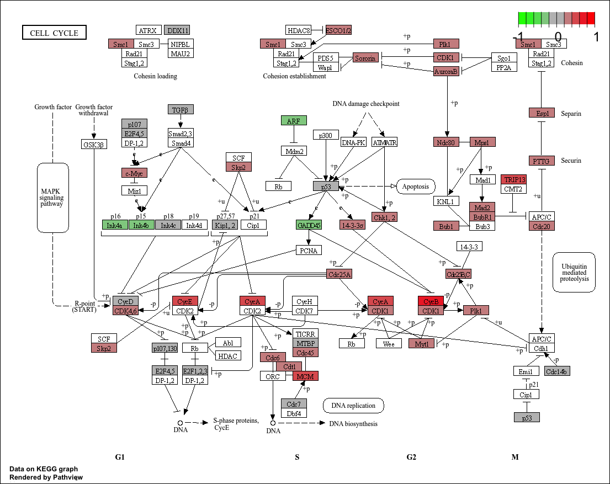

```{r setup, include=FALSE}
knitr::opts_chunk$set(
  echo      = FALSE,
  message   = FALSE,
  warning   = FALSE,
  fig.align = "center",
  fig.width = 8,
  fig.height = 6
)

# Carregar packages
library(Biobase)
library(limma)
library(pheatmap)
library(clusterProfiler)
library(org.Hs.eg.db)
library(pathview)
library(genefilter)
library(readr)
library(dplyr)

# Correr scripts de preparação de dados (não produzem gráficos)
source("../scripts/01_load_data.R")
source("../scripts/02_preprocessing_clinical.R")
source("../scripts/03_preprocessing_expression.R")
source("../scripts/04_merge_data.R")
```

# Objetivos da Fase 1

Nesta primeira fase pretende-se:

- descrever os dados, a sua origem e relevância
- realizar a preparação e o pré-processamento inicial dos dados
- efetuar uma sumarização dos dados com estatística descritiva e gráficos exploratórios
- realizar análise estatística univariada, análise de expressão diferencial e análise de enriquecimento

---

# Estrutura da análise

A análise está organizada nos seguintes scripts:

- `01_load_data.R` — carregamento dos dados brutos
- `02_preprocessing_clinical.R` — limpeza dos dados clínicos
- `03_preprocessing_expression.R` — preparação da matriz de expressão
- `04_merge_data.R` — integração e criação do ExpressionSet
- `05_exploratory_analysis.R` — exploração inicial (estatística descritiva e gráficos)
- `06_statistical_analysis.R` — análise estatística univariada e expressão diferencial
- `07_enrichment_analysis.R` — análise de enriquecimento funcional (KEGG)

---

# Introdução e Origem dos Dados

Este trabalho tem como objetivo a análise de um conjunto de dados de expressão génica no contexto do adenocarcinoma do pulmão (Lung Adenocarcinoma, LUAD), utilizando R e ferramentas do Bioconductor.

O conjunto de dados foi obtido a partir do **cBioPortal**, correspondendo ao estudo **Lung Adenocarcinoma (TCGA PanCancer Atlas)**. O LUAD é a forma mais comum de cancro do pulmão e a sua análise molecular tem contribuído para identificar alvos terapêuticos e biomarcadores de prognóstico. Os dados do TCGA integram informação clínica e molecular de larga escala, constituindo um dos maiores recursos para análise multiómica em oncologia.

A integração destes dados permite investigar diferenças biológicas entre grupos de pacientes com estádios tumorais distintos, contribuindo para uma melhor compreensão da progressão da doença e apoiando abordagens de medicina de precisão.

## Ficheiros utilizados

Foram utilizados três ficheiros principais:

- `data_clinical_patient.txt` — informação clínica ao nível do paciente
- `data_clinical_sample.txt` — informação ao nível da amostra tumoral
- `data_mrna_seq_v2_rsem.txt` — dados de expressão génica (RNA-seq, quantificação RSEM)

```{r dims_iniciais}
cat("Dimensões dos dados carregados:\n")
cat("  clinical_patient:", dim(clinical_patient), "\n")
cat("  clinical_sample:", dim(clinical_sample), "\n")
cat("  expr:", dim(expr), "\n")
```

## Descrição das variáveis

### Variáveis identificadoras

- **PATIENT_ID** — identificador único do paciente (ex: TCGA-05-4244)
- **SAMPLE_ID** — identificador da amostra (ex: TCGA-05-4244-01)

### Variáveis clínicas e categóricas

- **CANCER_TYPE_ACRONYM** — tipo de cancro (LUAD)
- **SEX** — sexo do paciente (Male / Female)
- **AJCC_PATHOLOGIC_TUMOR_STAGE** — estádio tumoral global (Stage I–IV)
- **PATH_T_STAGE**, **PATH_N_STAGE**, **PATH_M_STAGE** — componentes TNM
- **OS_STATUS** / **PFS_STATUS** — estado de sobrevivência / progressão
- **GENETIC_ANCESTRY_LABEL** — ancestralidade genética

### Variáveis numéricas clínicas

- **AGE** — idade no diagnóstico (anos)
- **OS_MONTHS** — sobrevivência global (meses)
- **PFS_MONTHS** — tempo até progressão (meses)

### Variáveis moleculares

- **ANEUPLOIDY_SCORE** — grau de instabilidade cromossómica
- **MSI_SCORE_MANTIS** — score de instabilidade de microssatélites
- **TMB_NONSYNONYMOUS** — carga mutacional tumoral (TMB)

### Dados de expressão génica

A matriz de expressão contém os níveis de atividade de cada gene em cada amostra. Os valores são quantificações RSEM, posteriormente transformadas em log2 durante o pré-processamento.

---

# Pré-processamento dos Dados Clínicos

Nesta etapa foram realizadas as seguintes operações sobre os dados clínicos:

- seleção das variáveis relevantes para a análise
- substituição de strings vazias por `NA`
- remoção de linhas sem identificador válido
- conversão das variáveis numéricas (AGE, OS_MONTHS, PFS_MONTHS, TMB, MSI, Aneuploidy)
- verificação de outliers — confirmou-se a ausência de valores impossíveis (ex: idades fora de [18, 100] ou valores negativos em variáveis de tempo)
- limpeza de prefixos nas variáveis de status (OS_STATUS, PFS_STATUS)
- conversão das variáveis categóricas para `factor`

```{r verificacoes_clinico}
cat("Valores em falta por variável (clin_clean):\n")
print(colSums(is.na(clin_clean)))
cat("\nDuplicados em PATIENT_ID:", sum(duplicated(clin_clean$PATIENT_ID)), "\n")
```

---

# Preparação da Matriz de Expressão

A preparação da matriz de expressão seguiu os seguintes passos:

1. **Identificação das colunas** de anotação dos genes e das colunas de amostras TCGA
2. **Construção da matriz numérica** com genes nas linhas e amostras nas colunas
3. **Remoção de genes sem identificador** válido e com valores `NA`
4. **Colapso de genes duplicados** com `limma::avereps` — quando o mesmo símbolo génico aparece em múltiplas linhas, calcula-se a média das expressões
5. **Filtragem de genes pouco expressos** — mantidos apenas genes com expressão > 1 em pelo menos 10% das amostras
6. **Transformação log2** — `log2(x + 1)` para estabilizar a variância e reduzir a assimetria da distribuição
7. **Filtro de variância** — remoção de genes com desvio-padrão abaixo da mediana dos SDs de todos os genes

O filtro de variância utiliza a mediana como critério de corte, mantendo apenas a metade dos genes com maior variabilidade entre amostras. Esta escolha é justificada pelo facto de genes com variação muito baixa não serem informativos para distinguir grupos — representam maioritariamente genes de manutenção celular (*housekeeping genes*) que se expressam de forma constante em qualquer condição.

```{r flat_patterns, fig.cap="Distribuição dos desvios-padrão por gene. A linha vermelha representa a mediana — genes à esquerda foram removidos por terem variação insuficiente."}
sds <- apply(expr_log2, 1, sd, na.rm = TRUE)
m   <- median(sds, na.rm = TRUE)

hist(sds,
     main   = "Distribuição dos desvios-padrão por gene",
     xlab   = "Desvio-padrão",
     ylab   = "Frequência",
     col    = "lightgrey",
     breaks = 40)
abline(v = m, col = "red", lty = 2, lwd = 2)
legend("topright",
       legend = paste("Cutoff = mediana (", round(m, 2), ")"),
       col = "red", lty = 2, lwd = 2, bty = "n")
```

O histograma mostra que a maioria dos genes se concentra em valores baixos de SD, com uma cauda longa para a direita. Os genes à esquerda da linha vermelha, com variação abaixo da mediana, foram removidos por não serem informativos para a análise.

```{r dims_expr}
cat("Dimensão final da matriz de expressão (log2):", dim(expr_log2), "\n")
```

---

# Integração dos Dados

Os dados clínicos foram integrados por PATIENT_ID e alinhados com a matriz de expressão por SAMPLE_ID. O alinhamento foi verificado com `identical()` e `stopifnot()` para garantir que a ordem das amostras é exatamente a mesma nos dois datasets. Sem este passo, estaríamos em risco de associar dados clínicos de um doente ao perfil de expressão de outro.

O resultado é um objeto `ExpressionSet` do Bioconductor, que integra a matriz de expressão e os metadados clínicos numa estrutura única e segura.

```{r eset_info}
cat("ExpressionSet final:\n")
print(eset)
```

---

# Exploração Estatística

```{r setup_exploratorio}
expr_mat <- exprs(eset)
meta     <- pData(eset)

tabela_estadios <- table(meta$AJCC_PATHOLOGIC_TUMOR_STAGE, useNA = "ifany")
tabela_sexo     <- table(meta$SEX, useNA = "ifany")
tabela_os       <- table(meta$OS_STATUS, useNA = "ifany")
tabela_pfs      <- table(meta$PFS_STATUS, useNA = "ifany")

vars_cor <- c("AGE", "OS_MONTHS", "TMB_NONSYNONYMOUS",
              "ANEUPLOIDY_SCORE", "MSI_SCORE_MANTIS")
meta_num <- meta[, vars_cor]
meta_num <- meta_num[complete.cases(meta_num), ]
```

## Variáveis categóricas

```{r barplot_estadio, fig.cap="Distribuição dos estádios tumorais na coorte LUAD-TCGA."}
barplot(tabela_estadios, main = "Distribuição dos estádios do cancro",
        col = "coral", las = 2, cex.names = 0.7)
```

Observa-se uma distribuição assimétrica dos estádios tumorais, com maior concentração de doentes nos estádios iniciais (Stage IA e IB). Os estádios mais avançados (IIIB e IV) são menos representados, o que é consistente com diagnóstico precoce predominante neste conjunto de dados.

```{r barplot_sexo, fig.cap="Distribuição por sexo."}
barplot(tabela_sexo, main = "Distribuição por sexo", col = "lightpink")
```

A variável sexo apresenta uma distribuição relativamente equilibrada, com ligeira predominância de doentes do sexo feminino.

```{r barplots_status, fig.cap="Distribuição de OS_STATUS e PFS_STATUS."}
par(mfrow = c(1, 2))
barplot(tabela_os,  main = "OS_STATUS",  col = "lightgreen")
barplot(tabela_pfs, main = "PFS_STATUS", col = "lightblue")
par(mfrow = c(1, 1))
```

Relativamente à sobrevivência global (OS_STATUS), observa-se uma predominância de doentes com estado "LIVING", consistente com a coorte ser maioritariamente composta por estádios iniciais. No que diz respeito à progressão da doença (PFS_STATUS), a maioria das amostras está classificada como "CENSORED", indicando que não foi observada progressão durante o período de seguimento.

## Variáveis numéricas

```{r descritiva_idade, fig.cap="Distribuição e boxplot da idade dos doentes."}
cat("Estatística descritiva — Idade:\n")
print(summary(meta$AGE))

par(mfrow = c(1, 2))
hist(meta$AGE, main = "Distribuição da idade", xlab = "Idade (anos)",
     col = "lightblue", breaks = 20)
boxplot(meta$AGE, main = "Boxplot da idade", ylab = "Anos", col = "lightblue")
par(mfrow = c(1, 1))
```

A distribuição etária é aproximadamente unimodal, centrada entre os 60 e 75 anos. A mediana situa-se próxima dos 65 anos e não se observam outliers extremos, indicando uma distribuição estável e consistente com a epidemiologia do LUAD.

```{r descritiva_os, fig.cap="Distribuição e boxplot da sobrevivência global."}
cat("Estatística descritiva — OS_MONTHS:\n")
print(summary(meta$OS_MONTHS))

par(mfrow = c(1, 2))
hist(meta$OS_MONTHS, main = "Distribuição de OS_MONTHS",
     xlab = "Overall survival (meses)", col = "lightgreen", breaks = 20)
boxplot(meta$OS_MONTHS, main = "Boxplot de OS_MONTHS",
        ylab = "Meses", col = "lightgreen")
par(mfrow = c(1, 1))
```

A variável OS_MONTHS apresenta uma distribuição fortemente assimétrica à direita, com elevada concentração de observações em valores baixos e uma cauda longa, padrão típico de dados de sobrevivência.

```{r descritiva_tmb, fig.cap="Distribuição e boxplot da carga mutacional tumoral (TMB)."}
cat("Estatística descritiva — TMB:\n")
print(summary(meta$TMB_NONSYNONYMOUS))

par(mfrow = c(1, 2))
hist(meta$TMB_NONSYNONYMOUS, main = "Distribuição de TMB",
     xlab = "TMB", col = "lavender", breaks = 30)
boxplot(meta$TMB_NONSYNONYMOUS, main = "Boxplot de TMB",
        ylab = "TMB", col = "lavender")
par(mfrow = c(1, 1))
```

A TMB apresenta distribuição fortemente assimétrica à direita. A maioria dos tumores tem baixa carga mutacional e um subconjunto reduzido apresenta valores muito elevados, padrão típico em dados oncogenómicos.

```{r descritiva_mol, fig.cap="Distribuição do Aneuploidy Score e MSI_SCORE_MANTIS."}
par(mfrow = c(1, 2))
hist(meta$ANEUPLOIDY_SCORE, main = "Aneuploidy Score",
     xlab = "Score", col = "lightyellow", breaks = 20)
hist(meta$MSI_SCORE_MANTIS, main = "MSI_SCORE_MANTIS",
     xlab = "Score", col = "lightgray", breaks = 20)
par(mfrow = c(1, 1))
```
O Aneuploidy Score apresenta uma distribuição aproximadamente simétrica, centrada entre os 15 e os 20 pontos, indicando um nível moderado de instabilidade cromossómica na maioria dos tumores. O MSI_SCORE_MANTIS mostra uma distribuição muito estreita e concentrada perto de 0.30, padrão esperado, uma vez que o LUAD não é tipicamente caracterizado por elevada instabilidade genómica.

## Relações entre variáveis

```{r boxplots_grupos, fig.cap="TMB por estádio tumoral e por sexo."}
par(mfrow = c(1, 2))
boxplot(TMB_NONSYNONYMOUS ~ AJCC_PATHOLOGIC_TUMOR_STAGE, data = meta,
        col = "lightgrey", las = 2, main = "TMB por estádio", cex.axis = 0.65)
boxplot(TMB_NONSYNONYMOUS ~ SEX, data = meta,
        col = c("pink", "lightblue"), main = "TMB por sexo")
par(mfrow = c(1, 1))
```

A comparação da TMB entre estádios não revela diferenças abruptas, embora se observe alguma variabilidade intra-estádio. A distribuição da TMB por sexo é semelhante entre os grupos, sem diferenças substanciais.

```{r correlacoes}
cat("Correlações de Pearson:\n")
print(round(cor(meta_num, method = "pearson"), 3))
cat("\nCorrelações de Spearman:\n")
print(round(cor(meta_num, method = "spearman"), 3))
```

```{r pairs_plot, fig.cap="Comparação de todos os pares de variáveis numéricas clínicas.", fig.height=7}
pairs(meta_num, main = "Comparação de variáveis numéricas clínicas",
      pch = 16, cex = 0.4, col = "steelblue")
```

Não se observam correlações fortes entre as variáveis analisadas. A relação entre TMB e MSI_SCORE_MANTIS apresenta uma correlação positiva moderada, coerente com a biologia dos tumores com instabilidade de microssatélites.

## Controlo de qualidade da expressão génica

```{r qc_boxplot, fig.cap="Boxplot de expressão por amostra (subconjunto de 40 amostras). A linha vermelha representa a mediana global."}
n_show   <- min(40, ncol(expr_mat))
idx_show <- round(seq(1, ncol(expr_mat), length.out = n_show))

boxplot(
  expr_mat[, idx_show],
  col = "lightblue", las = 2, outline = FALSE,
  main = "Boxplot de expressão por amostra (subconjunto)",
  ylab = "log2 expressão", xaxt = "n"
)
abline(h = median(expr_mat, na.rm = TRUE), col = "red", lty = 2)
```

```{r qc_density, fig.cap="Curvas de densidade de expressão por amostra."}
plotDensities(expr_mat, legend = FALSE,
              main = "Distribuição da expressão génica entre amostras")
```

O boxplot mostra que as distribuições de expressão são homogéneas entre amostras, as caixas estão todas alinhadas à mesma altura em torno da mediana global (linha vermelha). As curvas de densidade sobrepostas confirmam este resultado. Em conjunto, estes dois gráficos indicam que a normalização e a transformação log2 foram bem-sucedidas, não existindo amostras discrepantes que possam distorcer as análises.

---

# Análise Estatística e Expressão Diferencial

```{r limma_setup}
# Criar STAGE_GROUP
meta$STAGE_GROUP <- NA
meta$STAGE_GROUP[meta$AJCC_PATHOLOGIC_TUMOR_STAGE %in% c(
  "STAGE I", "STAGE IA", "STAGE IB",
  "STAGE II", "STAGE IIA", "STAGE IIB")] <- "Early"
meta$STAGE_GROUP[meta$AJCC_PATHOLOGIC_TUMOR_STAGE %in% c(
  "STAGE IIIA", "STAGE IIIB", "STAGE IV")] <- "Advanced"
meta$STAGE_GROUP <- factor(meta$STAGE_GROUP, levels = c("Early", "Advanced"))
pData(eset) <- meta

# Filtrar amostras completas
vars_modelo <- c("STAGE_GROUP", "AGE", "SEX")
keep        <- complete.cases(pData(eset)[, vars_modelo])
eset_stat   <- eset[, keep]
expr_stat   <- exprs(eset_stat)
meta_stat   <- pData(eset_stat)

# Modelo limma
design <- model.matrix(~ STAGE_GROUP + AGE + SEX, data = meta_stat)
colnames(design) <- make.names(colnames(design))
fit <- lmFit(expr_stat, design)
fit <- eBayes(fit)

# Resultados
resultados <- topTable(fit, coef = "STAGE_GROUPAdvanced",
                       number = Inf, sort.by = "P")
resultados$Gene <- rownames(resultados)
resultados <- resultados[, c("Gene", setdiff(colnames(resultados), "Gene"))]

# Guardar
write.csv(resultados,
          "../data/processed/resultados_limma_stage_age_sex.csv",
          row.names = FALSE)

# Análise diferencial por sexo
vars_sexo <- c("SEX", "AGE")
keep_sexo <- complete.cases(pData(eset)[, vars_sexo])
eset_sexo <- eset[, keep_sexo]
meta_sexo <- pData(eset_sexo)
meta_sexo$SEX <- factor(meta_sexo$SEX, levels = c("Female", "Male"))

design_sexo <- model.matrix(~ SEX + AGE, data = meta_sexo)
colnames(design_sexo) <- make.names(colnames(design_sexo))
fit_sexo <- lmFit(exprs(eset_sexo), design_sexo)
fit_sexo <- eBayes(fit_sexo)

resultados_sexo <- topTable(fit_sexo, coef = "SEXMale",
                            number = Inf, sort.by = "P")
resultados_sexo$Gene <- rownames(resultados_sexo)
```

A análise de expressão diferencial foi realizada com o package `limma`, usando o modelo `~ STAGE_GROUP + AGE + SEX`. Este modelo permite identificar genes diferencialmente expressos entre estádios tumorais (Early vs Advanced) enquanto controla simultaneamente para os efeitos da idade e do sexo. O ajuste empírico de Bayes (`eBayes`) melhora as estimativas de variância de cada gene utilizando informação partilhada entre todos os genes, tornando o método mais robusto do que um simples t-test gene a gene.

```{r limma_res}
cat("Amostras no modelo:", ncol(expr_stat), "\n")
cat("Genes analisados:", nrow(resultados), "\n")
cat("Genes com adj.P.Val < 0.05:",
    sum(resultados$adj.P.Val < 0.05, na.rm = TRUE), "\n")
cat("  Upregulated em Advanced (logFC > 0):",
    sum(resultados$adj.P.Val < 0.05 & resultados$logFC > 0, na.rm = TRUE), "\n")
cat("  Downregulated em Advanced (logFC < 0):",
    sum(resultados$adj.P.Val < 0.05 & resultados$logFC < 0, na.rm = TRUE), "\n")
cat("\nTop 10 genes mais significativos:\n")
print(head(resultados[, c("Gene", "logFC", "AveExpr", "P.Value", "adj.P.Val")], 10))
```

## Volcano plot

```{r volcano, fig.cap="Volcano plot: Advanced vs Early. Vermelho = upregulated em Advanced; Azul = downregulated em Advanced; Cinzento = não significativo."}
sig     <- resultados$adj.P.Val < 0.05 & !is.na(resultados$adj.P.Val)
col_pts <- rep("grey60", nrow(resultados))
col_pts[sig & resultados$logFC > 0] <- "tomato"
col_pts[sig & resultados$logFC < 0] <- "steelblue"

with(resultados, plot(
  logFC, -log10(P.Value),
  pch = 16, cex = 0.6, col = col_pts,
  main = "Volcano plot: Advanced vs Early",
  xlab = "logFC", ylab = "-log10(p-value)"
))
abline(h = -log10(0.05), lty = 2, col = "gray40")
legend("topright",
       legend = c("Up (adj.P < 0.05)", "Down (adj.P < 0.05)", "NS"),
       col = c("tomato", "steelblue", "grey60"),
       pch = 16, bty = "n")
```

O volcano plot mostra a distribuição de todos os genes segundo a magnitude da diferença de expressão (logFC) e a significância estatística. Os genes a vermelho estão mais ativos nos tumores avançados e os a azul estão menos ativos. Observa-se um número moderado de genes significativos, sugerindo que as diferenças entre estádios existem mas não são massivas ao nível de todo o transcriptoma.

## MD plot

```{r mdplot, fig.cap="MD plot: logFC em função da expressão média. Permite verificar a ausência de bias sistemático na análise."}
plotMD(
  fit,
  column = which(colnames(design) == "STAGE_GROUPAdvanced"),
  status = decideTests(fit)[, "STAGE_GROUPAdvanced"],
  main   = "MD plot: Advanced vs Early",
  hl.col = c("steelblue", "tomato")
)
abline(h = 0, col = "grey40", lty = 2)
```

A distribuição simétrica em torno de zero indica ausência de *bias* sistemático, genes muito ou pouco expressos não tendem a aparecer mais como diferencialmente expressos do que os restantes.

## Heatmap dos genes mais significativos

```{r heatmap_de, fig.cap="Heatmap dos top 30 genes DE. As barras de anotação indicam o estádio e a idade de cada amostra.", fig.height=9}
genes_sig <- resultados$Gene[resultados$adj.P.Val < 0.05]

if (length(genes_sig) >= 2) {
  n_heat     <- min(30, length(genes_sig))
  genes_heat <- genes_sig[1:n_heat]

  annotation_col <- data.frame(
    STAGE_GROUP = meta_stat$STAGE_GROUP,
    AGE         = meta_stat$AGE
  )
  rownames(annotation_col) <- colnames(expr_stat)

  pheatmap(
    expr_stat[genes_heat, , drop = FALSE],
    scale             = "row",
    show_colnames     = FALSE,
    annotation_col    = annotation_col,
    main              = paste0("Top ", n_heat, " genes DE: Advanced vs Early"),
    fontsize_row      = 7
  )
}
```

O heatmap evidencia perfis de expressão distintos nos genes mais significativos. As anotações clínicas no topo permitem verificar visualmente se os agrupamentos de amostras correspondem ao estádio ou à idade. A ausência de separação perfeita é esperada, os dados tumorais têm elevada heterogeneidade biológica intrínseca.

---

## Análise diferencial por sexo

Para além da análise por estádio, explorou-se também o efeito do sexo na expressão génica, dado ser uma variável biológica com impacto reconhecido no transcriptoma humano. Usou-se o modelo `~ SEX + AGE`, controlando para a idade.

```{r sexo_res}
cat("Genes com adj.P.Val < 0.05 (Female vs Male):",
    sum(resultados_sexo$adj.P.Val < 0.05, na.rm = TRUE), "\n")
cat("  Upregulated em Male (logFC > 0):",
    sum(resultados_sexo$adj.P.Val < 0.05 & resultados_sexo$logFC > 0, na.rm = TRUE), "\n")
cat("  Downregulated em Male (logFC < 0):",
    sum(resultados_sexo$adj.P.Val < 0.05 & resultados_sexo$logFC < 0, na.rm = TRUE), "\n")
cat("\nTop 10 genes:\n")
print(head(resultados_sexo[, c("Gene", "logFC", "P.Value", "adj.P.Val")], 10))
```

```{r volcano_sexo, fig.cap="Volcano plot: Male vs Female. Laranja = upregulated em Male; Verde = upregulated em Female; Cinzento = não significativo."}
sig_sexo <- resultados_sexo$adj.P.Val < 0.05 & !is.na(resultados_sexo$adj.P.Val)
col_sexo <- rep("grey60", nrow(resultados_sexo))
col_sexo[sig_sexo & resultados_sexo$logFC > 0] <- "darkorange"
col_sexo[sig_sexo & resultados_sexo$logFC < 0] <- "forestgreen"

with(resultados_sexo, plot(
  logFC, -log10(P.Value),
  pch = 16, cex = 0.6, col = col_sexo,
  main = "Volcano plot: Male vs Female",
  xlab = "logFC", ylab = "-log10(p-value)"
))
abline(h = -log10(0.05), lty = 2, col = "gray40")
legend("topright",
       legend = c("Up em Male", "Up em Female", "NS"),
       col = c("darkorange", "forestgreen", "grey60"),
       pch = 16, bty = "n")
```

Os genes mais significativos correspondem a genes do cromossoma Y, como RPS4Y1, DDX3Y, KDM5D e UTY, com maior expressão em amostras masculinas, e ao XIST, com maior expressão em amostras femininas. Estes resultados são biologicamente coerentes e indicam que o sexo tem um efeito marcado e real no transcriptoma tumoral desta coorte, independentemente do estádio ou da idade.

---

# Análise de Enriquecimento Funcional (KEGG)

```{r enrichment_setup}
source("../scripts/07_enrichment_analysis.R")
```

A análise de enriquecimento KEGG utiliza os genes diferencialmente expressos como conjunto alvo e todos os genes testados como universo. Para cada via biológica conhecida, testa se o número de genes DE nessa via é maior do que o esperado por acaso, usando um teste hipergeométrico com correção de Benjamini-Hochberg.

```{r kegg_res}
if (nrow(kk_df) > 0) {
  cat("Vias KEGG significativamente enriquecidas:", nrow(kk_df), "\n\n")
  cat("Top vias KEGG:\n")
  print(head(kk_df[, c("ID", "Description", "GeneRatio", "p.adjust")], 10))
} else {
  cat("Nenhuma via KEGG significativamente enriquecida encontrada.\n")
}
```

```{r kegg_dotplot, fig.cap="Dotplot das vias KEGG enriquecidas. O tamanho do ponto é proporcional ao número de genes; a cor indica o p-valor ajustado."}
if (nrow(kk_df) > 0) {
  print(dotplot(kk, showCategory = min(15, nrow(kk_df)),
                title = "Enriquecimento KEGG: Advanced vs Early"))
}
```

## Pathview — Via do ciclo celular (hsa04110)

A via do ciclo celular foi selecionada por se encontrar entre as vias com maior enriquecimento. O mapa KEGG gerado com o `pathview` integra os valores de logFC de cada gene, mostrando a magnitude e a direção das alterações no contexto da via.

```{r pathview_img, out.width="100%"}

```

A visualização evidencia alterações em múltiplos componentes da via do ciclo celular, com presença simultânea de genes sobre- e sub-expressos no grupo Advanced — sugerindo remodelação transcricional complexa dos mecanismos de controlo da proliferação na progressão tumoral.

---

# Conclusão

A análise desta primeira fase permitiu caracterizar o conjunto de dados LUAD-TCGA e identificar alterações transcriptómicas associadas ao estádio tumoral:

- A exploração descritiva revelou predominância de estádios iniciais, distribuição etária centrada nos 60–75 anos e ausência de correlações fortes entre variáveis clínicas e moleculares.
- O controlo de qualidade da expressão confirmou a homogeneidade das amostras após transformação log2, sem amostras discrepantes.
- A análise diferencial com limma, ajustada para idade e sexo, identificou genes significativamente alterados entre estádios Early e Advanced, com genes tanto upregulated como downregulated em Advanced.
- A análise de enriquecimento KEGG apontou para envolvimento de vias de proliferação celular na progressão tumoral, com a via do ciclo celular (hsa04110) a evidenciar alterações em múltiplos reguladores.

Estes resultados fornecem a base para as análises não supervisionadas da Fase 2.
